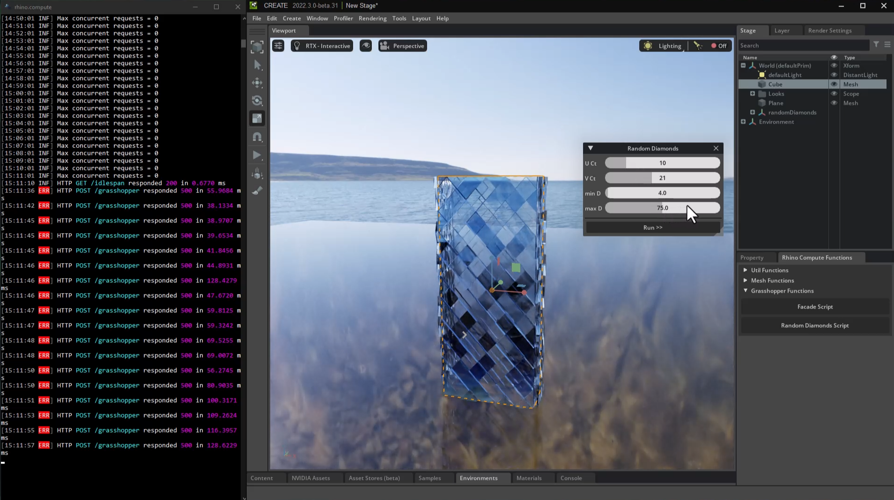

# About

This is an extension designed to run in a Nvidia Omniverse application such as Create or Machinima. The extension  creates a link to a Rhino.Compute Server [https://developer.rhino3d.com/guides/compute/] allowing you to run Rhino commands such as quad remesh or Grasshopper files.

This is designed to be a sample to extend. there are examples for using some basic rhino command like volume and quad remesh as well as running a Grasshopper script. Use this as a starting point to integrate your grasshopper scripts and functions directly into Omniverse and create the necessary UI elements. 

# Using It

- "app" - It is a folder link to the location of your *Omniverse Kit* based app.
- "exts" - is the folder where you add to extension search path. (Extension Manager -> Gear Icon -> Extension Search Path).

Open this folder using Visual Studio Code. It will suggest you install a few extensions that will make python experience better. 

Look for "cerver.util.rhinocompute" extension in extension manager inside Omniverse Create and enable it. Try applying changes to any python files, it will hot-reload and you can observe results immediately.

The first time you enable it will take some time to load. this is because all of the required packages from rhino and rhino compute will be installed into your Omniverse python library via a automatic pip install. 

# 3rd party Libraries

This project references 3rd party libraries with the following licensing 

Rhino.compute
https://github.com/mcneel/compute.rhino3d/blob/master/LICENSE

Rhino3dm
https://github.com/mcneel/rhino3dm/blob/main/LICENSE 

Plotly
https://github.com/plotly/plotly.py/blob/master/LICENSE.txt

